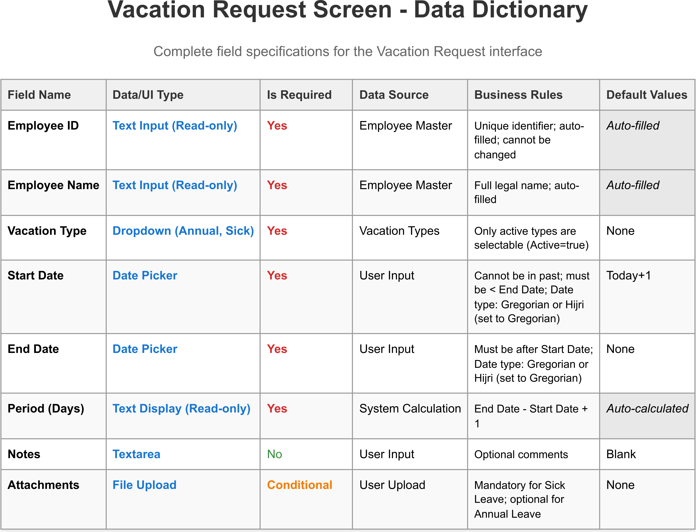

# Business Analysis Learning Repository

A comprehensive educational resource demonstrating core Business Analysis deliverables and documentation standards using a Vacation Management System as a practical example.

## 🌐 Live Project Preview

**View the complete project structure with interactive navigation:**
**[tryomar.github.io/Vacation-System/](https://tryomar.github.io/Vacation-System/)**

This interactive HTML page is **auto-generated** by the [`generate-tree.js`](Scripts/generate-tree.js) script located in the [Scripts](Scripts/) folder and provides a user-friendly way to navigate through all files, diagrams, and deliverables in this repository.

## 📸 Project Screenshots

### Main Interface

*Interactive project dashboard generated by the automation scripts - shows the complete project structure with clickable navigation to all deliverables*

### Automation Scripts

*Script for converting HTML files to PDF format - demonstrates automation capabilities for document management*

### Diagram Examples

The following examples showcase the various types of Business Analysis deliverables included in this project. Each diagram demonstrates professional modeling techniques and standards used in real-world BA projects.

#### Use Cases


*Employee Vacation Request use case diagram - shows the complete workflow from request submission to approval, including actors, preconditions, and post-conditions*

#### User Stories


*User story for vacation request submission - demonstrates agile requirements format with acceptance criteria and business value focus*

#### Wireframe Examples


*Vacation request interface wireframe - shows UI/UX design considerations and user interface requirements for the vacation request form*


*Mobile vacation request wireframe - demonstrates responsive design considerations and mobile-first user experience for vacation requests*


#### Data Dictionary Examples



*Screen data dictionary for vacation request - defines all data elements, validation rules, and business logic for the vacation request interface*

#### Business Process Diagrams


*Basic vacation request workflow - illustrates the standard approval process flow with decision points and business rules*


*Vacation request state diagram - shows the complete lifecycle of a vacation request from draft to approved/rejected states*


*System context diagram - defines the boundaries of the vacation management system and its interactions with external entities like employees, managers, and HR systems*

#### Data Modeling


*Entity Relationship Diagram (ERD) - shows the database structure and relationships between vacation system entities including employees, departments, vacation types, and vacation requests*

## 🎯 Learning Objectives

This repository serves as a **practical Business Analysis learning resource** that demonstrates:

- **Requirements Engineering** - Software Requirements Specification (SRS) development
- **Use Case Modeling** - Detailed use case specifications with actors and flows
- **Business Process Modeling** - Workflow diagrams and state transitions
- **Data Modeling** - Data dictionaries and entity relationship definitions
- **UI/UX Design** - Wireframes and user interface mockups
- **Documentation Standards** - Professional BA deliverable templates

## 🏗️ Project Overview

The **Vacation Management System** exemplifies real-world Business Analysis by modeling:
- **Employee vacation request workflows** with approval processes
- **Manager review and approval** business processes
- **Vacation balance tracking** and automated business rules
- **Reporting and inquiry** capabilities for stakeholders
- **Notification systems** for business communication

## 📁 Project Structure

```
Business Analysis Repository/
│   .gitignore
│   index.html
│   README.md
│   SRS_Vacation_Management_System.pdf
│   SRS_Vacation_Management_System.tex
│
├───Screenshots
│   ├───README.md
│   ├───index-html-dashboard.png
│   └───batch-html-to-pdf-script.png
│
├───Data-Dictionary
│   ├───Data-Dictionary-Template
│   ├───Master-Data-Dictionaries
│   │   ├───Departments-Master-Data-Data-Dictionary
│   │   ├───Employee-Master-Data-Data-Dictionary
│   │   └───Vacation-Types-Master-Data-Data-Dictionary
│   └───Screen-Data-Dictionaries
│       ├───Vacation-Request-Screen-Data-Dictionary
│       ├───Review-Vacation-Request-Screen-Data-Dictionary
│       └───[Additional screen data dictionaries...]
│
├───Diagrams
│   ├───Context
│   ├───State-Diagram
│   └───Workflows
│       ├───Vacation-Request-Basic-Flow
│       ├───Vacation-Request-Escalation-to-Sponsor
│       └───Vacation-Request-Resubmission-After-Rejection
│
├───Requirements
│   ├───SRS_Vacation_Management_System.pdf
│   ├───Project-Scope.md
│   └───MinutesOfMeeting_Thursday_7Aug.md
│
├───Scripts
│   ├───collect-usecases.ps1
│   ├───batch-html-to-pdf.js
│   ├───generate-tree.js
│   └───package.json
│
├───Use-Cases
│   ├───UC-1-Employee-Vacation-Request
│   ├───UC-2-Employee-Vacation-Cancellation-Request
│   ├───UC-3-My-Vacation-Requests
│   ├───[Additional use cases...]
│   ├───UC-12-Automated-Update-of-Employee-Annual-Vacation-Balance
│   ├───Use-Case-Template
│   ├───Generated-UseCases-JSON
│   └───Messages-Table
│
├───User-Stories
│   ├───US-1-Employee-Submits-Vacation-Request
│   ├───US-2-Employee-Submits-Vacation-Cancellation-Request
│   ├───US-3-Employee-Views-My-Vacation-Requests
│   ├───[Additional user stories...]
│   ├───US-12-System-Automatically-Updates-Employee-Annual-Vacation-Balance
│   └───User-Story-Template
│
└───Wireframes
    ├───Vacation-Request
    ├───Vacation-Cancellation-Request
    ├───My-Vacation-Requests
    ├───[Additional wireframes...]
    ├───Print-Layout-Single-Transaction-Report
    └───Print-Layout-Annual-Comparative-Report
```

## 📋 Business Analysis Deliverables

### Requirements & Specifications
**Why Business Analysts Create These:**
Requirements are the foundation of any project. BAs create these documents to ensure all stakeholders understand what the system should do, why it's needed, and what success looks like.

- **SRS Document** - Complete software requirements specification demonstrating requirements gathering
- **Project Scope** - Business requirements and project boundaries definition  
- **Meeting Minutes** - Stakeholder engagement and requirements elicitation documentation

### Use Case Modeling
**Why Business Analysts Create Use Cases:**
Use cases capture how users interact with the system to achieve business goals. They help BAs understand user needs, define system behavior, and ensure all scenarios are covered before development begins.

This project demonstrates 12 comprehensive use cases covering:
- Basic workflows (vacation requests, approvals)
- Alternative flows (cancellations, rejections)
- Exception handling (escalations, resubmissions)
- Reporting and analytics requirements
- Business rule automation

### User Stories
**Why Business Analysts Create User Stories:**
User stories provide a user-centric view of requirements that focuses on business value and user needs. They help BAs communicate requirements in simple, understandable language that stakeholders and development teams can easily grasp and implement.

This project includes 12 user stories that complement the use cases:
- **Employee-focused stories** - Vacation requests, cancellations, and inquiries
- **Manager workflows** - Review and approval processes
- **System automation** - Balance updates and notifications
- **Reporting capabilities** - Transaction reports and comparative analytics

Each user story follows the standard format: "As a [role], I want [feature] so that [benefit]" and includes acceptance criteria for clear implementation guidance.

### Business Process Modeling
**Why Business Analysts Create Process Models:**
Process models help BAs visualize how work flows through an organization, identify inefficiencies, and ensure the new system supports optimal business processes. They bridge the gap between current and future state.

- **Context Diagrams** - System boundaries and external interactions
- **State Diagrams** - Business process states and transitions
- **Workflow Diagrams** - Detailed business process flows including basic flows, escalations, and resubmissions

### Data Modeling
**Why Business Analysts Create Data Models:**
Data models ensure BAs understand what information the system needs to store, how it's organized, and how different parts of the system share data. This prevents data inconsistencies and integration issues.

- **Master Data Dictionaries** - Core business entities (Employee, Department, Vacation Types)
- **Screen Data Dictionaries** - User interface data requirements
- **Data Dictionary Templates** - Standardized data definition formats

### UI/UX Design
**Why Business Analysts Create Wireframes:**
Wireframes help BAs communicate interface requirements to stakeholders and developers. They ensure the system is intuitive, efficient, and meets user needs before expensive development begins.

This project includes wireframes for all major business functions:
- Request and approval interfaces
- Search and reporting screens
- Dashboard and notification views
- Print layouts for reports

## 🛠️ Automation Tools

**Why Business Analysts Use Automation:**
Automation helps BAs focus on analysis rather than repetitive tasks. These tools demonstrate how BAs can streamline documentation maintenance, ensure consistency, and reduce manual errors in large projects.

The project includes utility scripts demonstrating BA automation:
- **`collect-usecases.ps1`** - Automated use case data extraction
- **`batch-html-to-pdf.js`** - Document format conversion
- **`generate-tree.js`** - Project structure maintenance
- **`take-screenshots.bat`** - Helper script for taking project screenshots

*For detailed script documentation, see [Scripts/README.md](Scripts/README.md)*

## 🚀 Smart Documentation Features

**Why Business Analysts Need Smart Documentation:**
Modern BA projects require efficient documentation management. These features help BAs maintain consistency, track changes, and ensure all stakeholders have access to current information.

This project demonstrates modern BA practices:
- **Automated documentation maintenance** through git integration
- **Consistent formatting** across all deliverable types
- **Version-controlled requirements** with automated updates
- **Professional templates** for all BA artifacts

## 📦 Quick Start

**Why Business Analysts Need Quick Setup:**
Efficient project setup allows BAs to focus on analysis rather than technical configuration. This demonstrates how to organize a BA project for easy navigation and collaboration.

1. **Clone the repository**
2. **Install dependencies**: `cd Scripts && npm install`
3. **Generate project tree**: `node Scripts/generate-tree.js`
4. **Explore deliverables**: Open `index.html` for navigation

## 🔗 Git Integration

**Why Business Analysts Use Version Control:**
Version control helps BAs track changes to requirements, maintain audit trails, and collaborate with stakeholders. It ensures everyone works with the latest documentation and can see what changed and why.

Automated documentation maintenance through git hooks:
- **Post-commit automation** keeps project structure updated
- **Version-controlled requirements** with every change
- **Consistent project organization** across environments

## 📚 Business Analysis Learning Path

**Why This Learning Path Matters:**
Business Analysis requires systematic learning. This path follows the natural progression of a BA project, from understanding business needs to delivering complete specifications. Each step builds on the previous one.

This repository provides a complete learning journey:

1. **Start with Requirements** - Study the SRS and project scope
2. **Understand Use Cases** - Analyze the 12 use cases for modeling techniques
3. **Learn User Stories** - Review the 12 user stories for agile requirements
4. **Study Process Flows** - Review workflow and state diagrams
5. **Examine Data Models** - Learn data dictionary structures
6. **Review UI Designs** - Understand wireframe and interface requirements
7. **Practice Automation** - Use scripts to maintain documentation

## 🎓 What You'll Learn

**Why These Skills Are Essential:**
These are the core competencies every Business Analyst needs. They represent the complete toolkit for analyzing business problems, designing solutions, and communicating with stakeholders effectively.

- **Requirements Elicitation** techniques and documentation
- **Use Case Modeling** best practices and standards
- **User Story Development** for agile requirements and stakeholder communication
- **Business Process Modeling** with diagrams and workflows
- **Data Modeling** principles and dictionary creation
- **UI/UX Requirements** specification and wireframing
- **Professional Documentation** standards and templates
- **Requirements Management** with version control

## 🌟 Real-World Application

This repository demonstrates how Business Analysis principles apply to real business problems. The Vacation Management System serves as a practical example that shows:

- **How to analyze business processes** and identify improvement opportunities
- **How to gather requirements** from multiple stakeholder groups
- **How to model complex workflows** with multiple actors and scenarios
- **How to design user interfaces** that support business needs
- **How to maintain documentation** throughout the project lifecycle

---

*This project demonstrates professional Business Analysis deliverables and serves as a comprehensive learning resource for BA practitioners and students. Use it to understand how BA concepts apply in practice and develop the skills needed for successful business analysis projects.*
